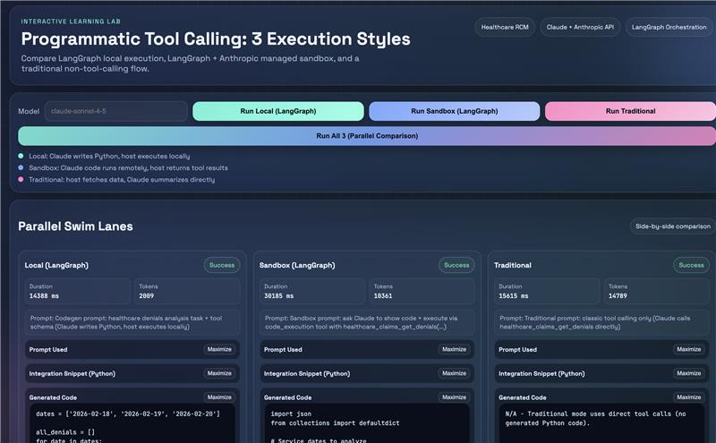
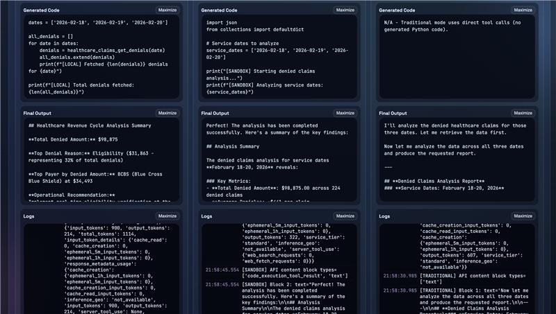

# Programmatic Tool Calling POC (3 Execution Styles)

A runnable Python demo that compares three ways to solve the same task (healthcare denied-claims analysis):

1. `Local (LangGraph)` -> Claude generates Python code, host executes it locally
2. `Sandbox (LangGraph + Anthropic code execution)` -> Claude runs code in Anthropic-managed sandbox and calls your local tool
3. `Traditional (classic tool calling)` -> Claude directly calls business tools (no generated Python, no code execution)

This project is built for learning and observability:

- prompts are visible
- generated code is visible (where applicable)
- logs are visible
- token usage is visible
- LLM TX/RX conversation timeline is visible
- side-by-side parallel swim lane comparison is available in the UI

## Why This Exists

The goal is to teach the shift from:

- "trust the model's natural-language reasoning"

to:

- "let the model write code / call tools, execute in a controlled way, and inspect what actually happened"

This is a teaching/demo project, not production code.

## Features

- Modern web UI for side-by-side comparison
- `Run All 3 (Parallel Comparison)` button
- Synchronized expand/collapse across swim lanes
- Maximize modal for prompts/snippets/code/logs/transcripts
- Color-coded TX/RX transcript view in maximize mode
- CLI wrappers for each mode
- `.env` loading without `python-dotenv` dependency

## Project Structure

- `web_app.py` -> Flask app and HTTP endpoints
- `demo_engine.py` -> core logic for all 3 modes
- `shared_tool.py` -> demo healthcare tool + dataset
- `anthropic_http.py` -> stdlib-based Anthropic Messages API client
- `local_agent.py` -> CLI wrapper for local mode
- `sandbox_simulator.py` -> CLI wrapper for sandbox mode
- `traditional_demo.py` -> CLI wrapper for traditional mode
- `run_demo.sh` -> one-command runner (web/local/sandbox/traditional/install)
- `POC_CONCEPT_GUIDE.md` -> layman-friendly conceptual explanation

## Requirements

- Python `3.10+` (tested in a `venv`)
- Anthropic API key
- Internet access (for API calls and dependency install)

## Setup

### 1. Clone and enter project

```bash
git clone https://github.com/sriharshavarada/Programatic-Tool-Calling-POC.git
cd Programatic-Tool-Calling-POC
```

### 2. Create / activate virtual environment (recommended)

```bash
python3 -m venv venv
source venv/bin/activate
```

### 3. Create `.env`

Copy the sample and fill your values:

```bash
cp .env_sample .env
```

At minimum, set:

```bash
ANTHROPIC_API_KEY=your_anthropic_api_key_here
```

Optional fields (already documented in `.env_sample`):

- `ANTHROPIC_MODEL`
- `ANTHROPIC_BETA`
- `ANTHROPIC_CODE_EXEC_TOOL_TYPE`
- `PORT`
- `AUTO_INSTALL_DEPS`

## Run (Recommended: Web UI)

```bash
bash run_demo.sh web
```

Then open:

- [http://127.0.0.1:8000](http://127.0.0.1:8000)

You can also just run:

```bash
bash run_demo.sh
```

(`web` is the default mode.)

## Run (CLI)

```bash
bash run_demo.sh local
bash run_demo.sh sandbox
bash run_demo.sh traditional
```

Or directly:

```bash
python3 local_agent.py
python3 sandbox_simulator.py
python3 traditional_demo.py
```

## What To Look At In The UI

### Top Controls

- `Run Local (LangGraph)`
- `Run Sandbox (LangGraph)`
- `Run Traditional`
- `Run All 3 (Parallel Comparison)`

### Parallel Swim Lanes

For each lane, inspect:

- `Prompt Used`
- `Integration Snippet (Python)`
- `Generated Code` (Local/Sandbox only)
- `Final Output`
- `Logs`
- `LLM Conversation Timeline (TX/RX)`

### Run Summary (Main Panel)

- duration
- model
- total tokens
- container id (sandbox mode)
- token usage JSON
- metadata JSON

## Mode Definitions (Important)

### Local (LangGraph)

- Claude generates Python code for the task
- Host executes generated code locally (`exec(...)`)
- Generated code calls the local business tool

### Sandbox (LangGraph + Anthropic code execution)

- Claude uses Anthropic-managed `code_execution`
- Sandbox code can call the local business tool via `tool_use` / `tool_result`
- Host app orchestrates the callback loop

### Traditional (Classic Tool Calling)

- Claude directly calls the business tool
- No generated Python
- No `code_execution` tool

## Important Note About Tokens

Programmatic tool calling does **not automatically** reduce token usage.

Why:

- If you send large tool results back as `tool_result` messages, that data can still contribute to token usage.
- Token behavior depends on tool payload design (rows vs aggregates), number of turns, and summary steps.

This POC is excellent for observing these tradeoffs in practice.

## Dataset / Tool Source

The demo data is in code (in-memory), not in a real DB.

See:

- `shared_tool.py` (`_DENIALS_BY_DATE` and expanded dataset generation)

The main business tool:

- `healthcare_claims_get_denials(service_date)`

## Screenshots

You shared UI screenshots during development. To make them appear in GitHub README, add them to the repo (for example under `docs/screenshots/`) and reference them like this:

```md


```

Embedded screenshots (if the files exist in `docs/screenshots/`):


Suggested screenshots to include:

- main page with controls + swim lanes
- one completed run showing all 3 lanes
- maximized TX/RX transcript popup (color-coded)

## Troubleshooting

### `Missing ANTHROPIC_API_KEY`

- Ensure `.env` exists
- Ensure the key is set in `.env`
- Restart the web app after editing `.env`

### `Missing langgraph` / dependency errors

Run:

```bash
bash run_demo.sh install
```

or:

```bash
pip install -r requirements.txt
```

### Sandbox mode beta / tool type issues

If Anthropic returns a beta-header-related error, set:

```bash
ANTHROPIC_BETA=advanced-tool-use-2025-11-20
```

## Conceptual Reading

- `POC_CONCEPT_GUIDE.md` -> non-technical / layman explanation of the POC

Relevant references:

- Anthropic Programmatic Tool Calling: <https://platform.claude.com/docs/en/agents-and-tools/tool-use/programmatic-tool-calling>
- Anthropic Tool Use (implementation): <https://docs.anthropic.com/en/docs/agents-and-tools/tool-use/implement-tool-use>
- Anthropic Code Execution Tool: <https://docs.anthropic.com/en/docs/agents-and-tools/tool-use/code-execution-tool>
- Cloudflare Code Mode MCP (conceptually related direction): <https://blog.cloudflare.com/code-mode-mcp/>

## Summary

This project helps you compare where agent systems are heading:

- not just natural-language-only orchestration
- but code-as-plan, tool execution, runtime observability, and verifiable outputs
